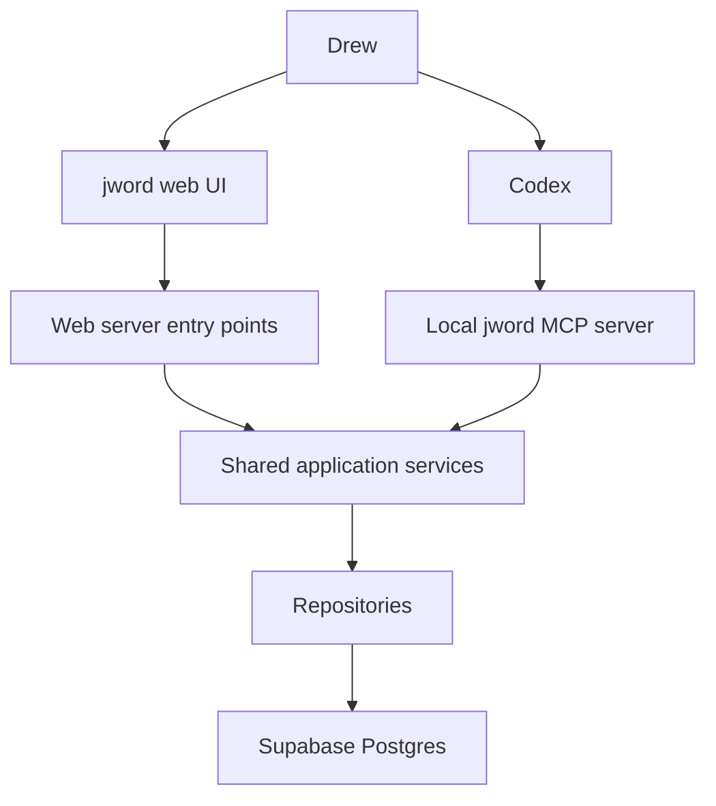
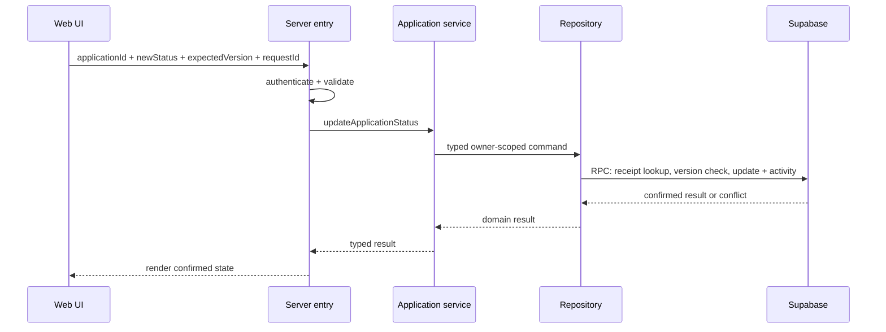
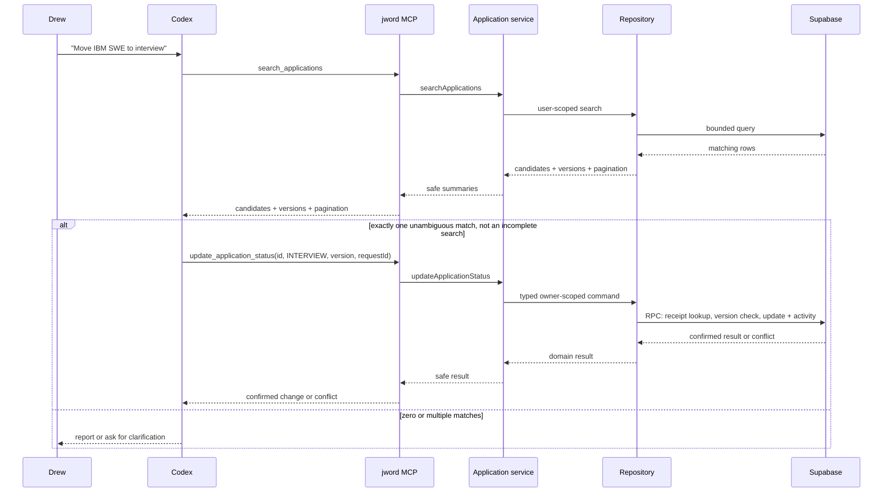
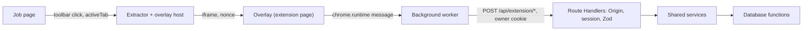

# jword v1 architecture

## Implementation status (2026-09-21)

Implemented as described below. Concrete locations:

| Layer            | Where                                                                                                                                                                                                              |
| ---------------- | ------------------------------------------------------------------------------------------------------------------------------------------------------------------------------------------------------------------ |
| Web entry points | `src/server/actions/*.ts` (Server Actions), `src/server/auth/session.ts` (`requireSession`), `src/proxy.ts` (session refresh + redirect)                                                                           |
| MCP entry points | `packages/mcp-server/src/tools.ts` (9 tools), `packages/mcp-server/src/index.ts` (stdio)                                                                                                                           |
| Posting capture  | `packages/extension` (Chrome extension: reads postings, in-page overlay), `src/app/api/extension/*` + `src/server/extension-api.ts` (capture API), `src/features/capture` (review UI), `packages/core/src/capture` |
| Shared services  | `packages/core/src/services/index.ts` (`createTrackerServices`)                                                                                                                                                    |
| Validation       | `packages/core/src/validation/schemas.ts` (Zod, strict objects)                                                                                                                                                    |
| Repositories     | `packages/core/src/repositories/supabase.ts` (owner-scoped queries + RPC), `types.ts` (contract), `testing/fake-repository.ts` (in-memory double)                                                                  |
| Database         | `supabase/migrations/20260921000100_schema.sql`, `..._mutation_functions.sql`, `..._candidate_profiles.sql`                                                                                                        |
| Import pipeline  | `packages/core/src/import/*` (parse, map, validate, duplicates)                                                                                                                                                    |

Deviations from the original plan are recorded in [decision 014](decisions/014-mvp-implementation-deviations.md): the candidate profile is included at the owner's request, and automated tests run against a local Supabase stack while the hosted project remains the real tracker.

## Overview

The design separates language interpretation from application authority.

- Codex interprets Drew's natural-language request.
- The jword MCP server exposes a small set of typed tools.
- A shared application-service layer owns validation and business rules.
- Repository adapters persist data to Supabase Postgres.
- The web UI calls the same services through server-side entry points.

No model runs inside jword in v1.



## Component responsibilities

### Web UI

- render tables, forms, detail views, import flow, and timeline
- collect explicit user input
- display safe validation and operation errors, never raw database error details
- never contain authoritative business rules or secrets

### Web server entry points

Use Next.js Server Actions for web mutations. Next.js handles the browser's HTTP POST request and dispatches it to the action; the browser does not execute database code. Each action verifies the caller and passes a validated command to the shared service. Use Server Components for server-rendered reads through the shared service layer. Reserve Route Handlers for explicit HTTP needs such as an authentication callback; do not create a parallel REST mutation API for the tracker. See [decision 005](decisions/005-web-server-actions.md). The one exception is the capture extension's five origin-restricted endpoints ([decision 017](decisions/017-extension-overlay-capture-api.md)).

Responsibilities:

- authenticate and authorize the browser session inside each action; a page-level login check does not protect the action by itself
- validate boundary input
- translate transport data into service commands
- call application services
- return serializable results

### MCP server

A local Node/TypeScript stdio process connected to Codex.

Responsibilities:

- declare only the tools in `AI_TOOLING_SPEC.md`
- validate tool input and output
- map tool calls to the shared service layer
- configure the single owner identity from server-only environment
- emit concise structured results

The MCP server must not expose arbitrary SQL, generic HTTP forwarding, shell execution, or a catch-all update function.

### Application services

The most important architectural seam.

Responsibilities:

- enforce required fields and allowed values
- normalize company/title inputs where needed
- resolve interactive date defaults using a shared clock and `JWORD_TIMEZONE=America/Chicago`; preserve unknown imported dates, per [decision 011](decisions/011-date-defaults-and-timezone.md)
- enforce user ownership
- coordinate repository operations
- make primary mutations and activity writes atomic
- preserve request IDs for retry protection; mutation transactions record a receipt and return it on identical retries without repeating writes, per [decision 009](decisions/009-mutation-retry-protection.md)
- require the caller's expected application version for existing-record mutations and translate a database version mismatch into a safe conflict result; see [decision 008](decisions/008-application-version-checks.md)
- return domain-oriented results and typed errors

Example services:

- `searchApplications(query, actor)`
- `createTrackedJob(command, actor)`
- `updateApplicationStatus(command, actor)`
- `updateApplicationDetails(command, actor)`
- `addApplicationNote(command, actor)`
- `updateApplicationNote(command, actor)`
- `previewImport(command, actor)`
- `commitImport(command, actor)`
- `getPipelineSummary(query, actor)`, `getStatusCounts(actor)`
- `getCandidateProfile(actor)`, `saveCandidateProfile(command, actor)`

`actor` includes owner ID and actor type (`USER`, `CODEX`, or `IMPORT`), assigned by the authenticated entry point rather than form/tool arguments. Actor labels describe the application's operational source; they are not cryptographic proof of which program originated a call using the same credential. Database functions independently enforce write invariants because an authenticated caller can invoke an exposed function without going through TypeScript.

### Repositories

- contain Supabase/Postgres queries
- receive explicit `userId` on every operation
- call one narrowly scoped database function for each logical mutation and its activity; do not split those writes across separate requests
- do not make UI or natural-language decisions
- translate database errors into repository errors

### Database

- stores canonical state
- enforces foreign keys, checks, uniqueness where appropriate, timestamps, and RLS
- restricts authenticated web writes to approved functions so direct table calls cannot bypass history, version checks, or retry protection
- uses narrowly scoped Postgres functions called through Supabase RPC (remote procedure call) to save a mutation, its activity, and related timestamps in one transaction; see [decision 002](decisions/002-atomic-mutations.md)

## Runtime paths

### Manual status update



### Natural-language update



## Trust boundaries and credentials

Approved on 2026-09-20: keep email sign-in for the hosted tracker and use a private local service-role credential for the MCP connector. See [decision 001](decisions/001-web-and-mcp-access.md). Current review status is in [Ticket 0 final review](TICKET_0_REVIEW.md).

### Browser

- receives only the Supabase public/anon configuration intended for browsers
- signs in through an email link or code on computer or phone; the browser retains the authenticated session, subject to expiry or sign-out
- relies on RLS as a database backstop
- has no direct table-write permission; web mutations reach the approved database functions through Server Actions (or, for the capture extension, the `/api/extension/*` handlers), shared services, and repositories, per [decision 010](decisions/010-function-only-web-writes.md)

### Next.js server

- uses the authenticated user's Supabase session for tracker operations; the local MCP credential is not used for web requests
- verifies the session and configured owner on every protected operation; provision the owner account directly and disable public self-signup
- keeps authenticated page/data responses out of shared caches and handles session refresh through the supported Supabase SSR integration
- must still pass the authenticated user's ID into services
- must never serialize server secrets to client components

### Local MCP process

- started by Codex through stdio
- receives secrets from local environment, not command-line literals committed to config
- is locked to `JWORD_OWNER_USER_ID`
- uses a Supabase service-role key for this personal local integration; every repository call must explicitly filter by the configured owner and mutation services must verify ownership
- requires no separate email sign-in or user-session login helper
- never returns the credential in tool results or includes it in browser code, logs, or Git
- a leaked service-role key bypasses RLS; document this risk and keep it local/server-only

The owner lock and bounded tools constrain normal connector operations, not the authority of the underlying key. The owner accepts this tradeoff for the personal MVP. A scoped jword access token or user-session flow is deferred.

## Approved workspace structure

Use a pnpm workspace: one repository with a root Next.js application and two related packages. pnpm manages dependencies and project commands with one lockfile. See [decision 003](decisions/003-shared-core-workspace.md).

```text
jword/
  AGENTS.md
  README.md
  docs/
  src/
    app/
    components/
    features/
      applications/
      import/
    server/
      actions/
      auth/
    lib/
      supabase/
  packages/
    core/
      src/
        domain/
        validation/
        services/
        repositories/
    mcp-server/
  supabase/
    migrations/
  tests/
    integration/             # database-backed (local Supabase)
    e2e/                     # Playwright
```

As built, `packages/core` exposes two entry points: `@jword/core/browser` (enums, types, schemas, import helpers; safe for client components) and `@jword/core` (adds services, repositories, and the Supabase client type; server only).

The website and MCP connector both depend on `core`; `core` depends on neither entry point. Keep business rules, shared validation, repository contracts, and the Supabase repository implementation in `core`. Keep cookies, web authentication, and Next.js APIs in the web adapter; keep MCP transport and local credential setup in the connector.

Pass authenticated database clients and actor context into the shared core rather than loading runtime credentials inside it. Expose browser-safe schemas separately from runtime services and repositories. Use explicit package exports and build shared code for standalone Node execution; do not make MCP import the website's source files or depend on a running web server. Keep one lockfile and root scripts, without additional monorepo orchestration tooling.

A future in-app chat or model integration can interpret requests and call the same services through a new adapter. Do not build provider abstractions or model integrations in v1. Public launch would separately require reviewing multi-user authorization, credentials, and AI usage/cost controls.

## Development database

Use the hosted Supabase project for real tracker use. Automated integration and browser tests use the local Docker stack, as subsequently approved in [decision 014](decisions/014-mvp-implementation-deviations.md). The test environment guard checks both HTTP endpoints and the direct database URL before creating temporary users.

Keep database changes in checked-in migrations. Validate the initial migrations against the empty hosted project before importing real data; later changes apply incrementally. Verify permissions and atomic behavior with targeted test records or transaction rollback where appropriate, without routine database resets. Unit tests can run without a database.

## Error model

Use typed application errors, including:

- `UNAUTHENTICATED`
- `FORBIDDEN`
- `NOT_FOUND`
- `VALIDATION_ERROR`
- `CONFLICT`
- `AMBIGUOUS_MATCH` (normally resolved before a mutation tool)
- `IMPORT_ROW_ERROR`
- `INTERNAL_ERROR`

UI and MCP layers translate these into appropriate human-readable messages without exposing secrets or raw database errors.

## Observability

v1 needs simple structured server logs, not a monitoring platform.

Log:

- operation name
- request/correlation ID
- actor type
- success/failure
- safe record identifiers
- duration

Do not log secrets, full notes, candidate-profile content, or CSV row bodies.

## Architecture decisions before scaffolding

All five choices below and the product decisions in records 006-013 are approved. See [Ticket 0 final review](TICKET_0_REVIEW.md). The MVP is implemented; the original pre-scaffolding choices below remain historical context.

1. **Approved:** Next.js Server Actions for web mutations, with shared service reuse; see [decision 005](decisions/005-web-server-actions.md).
2. **Approved:** one hosted Supabase project for MVP development and real use; no required local database or Docker setup. See [decision 004](decisions/004-hosted-only-development.md).
3. **Approved:** narrowly scoped Postgres functions called through Supabase RPC, with the mutation and activity in one transaction; see [decision 002](decisions/002-atomic-mutations.md).
4. **Approved:** pnpm workspace with the root web application, `packages/core`, and `packages/mcp-server`; see [decision 003](decisions/003-shared-core-workspace.md).
5. **Approved:** email-authenticated web sessions and a private local MCP service-role credential, as described in [decision 001](decisions/001-web-and-mcp-access.md).

These choices must preserve the contracts above.

## Reliability corrections (2026-09-22)

- Forms retain an immutable command and request ID while a save is unconfirmed. Retry uses that exact command, even after a server refresh. `OUTCOME_UNKNOWN` means the response was lost or cannot confirm the outcome; it never claims rollback. A confirmed rejection permits a revised command with a new ID. Unconfirmed forms lock their editable inputs; resolve the original save before navigating away.
- Stale detail edits retain their draft and original version across `router.refresh()`. The owner reviews current values, explicitly reapplies their edits, and saves only changed fields. Note drafts and inline selections are likewise retained for explicit reapplication.
- Web lists expose cursor links for applications, notes, and activity. Status counts and duplicate probes page through the database cap rather than silently truncating at 1000 rows.
- `domain/date-policy.ts` defines interactive date policy used by services and the test repository. Status services read current state to evaluate defaults; this read does not replace the database’s locked version check. Caller intent remains unchanged for retry fingerprints.
- Migration 005 places mutation implementations in the private schema and validates direct RPC inputs before delegating. SQL repeats essential write invariants because callers can bypass TypeScript. Company matching, duplicate detection, receipts, and history stay inside the transaction so concurrent saves cannot bypass them.
- Browser tests use `.next-e2e` on port 3100 so an existing developer server can remain running.

## Posting capture (2026-09-22)

Approved in [decision 016](decisions/016-browser-extension-capture.md), with the review moved into
an in-page overlay by [decision 017](decisions/017-extension-overlay-capture-api.md). A Chrome
extension reads a job posting and draws a review panel in the job tab. The panel is an extension
page in a closed shadow root, pinned right and pushing the page over. It reaches jword only
through the extension's background worker. The worker calls five origin-restricted JSON endpoints
with the owner's normal session cookie. The extension holds no credentials of its own.



- `packages/core/src/capture`: payload schema/normalizer and `planCaptureUpdate`, the rule for which
  posting fields may be written (blank fields pre-selected, overwrites opt-in; never status,
  priority, owner dates, company, or title).
- Creation reuses `createApplication` (duplicate check, `allowDuplicate` only after the owner saw
  the candidates). Updates reuse `updateApplicationDetails` with `expectedVersion`; a stale version
  refreshes the current values and keeps the owner's selection. The API's `update-posting` endpoint
  accepts only posting fields (`capturePostingUpdateSchema`) before the shared service validates
  the command again.
- `src/server/extension-origin.ts` / `extension-api.ts`: the Origin check (the extension id is
  pinned by the manifest `key` and configured as `JWORD_EXTENSION_ID`), then `requireSession`, then
  the handler. `src/proxy.ts` answers these paths with the handler's 401 rather than a redirect.
